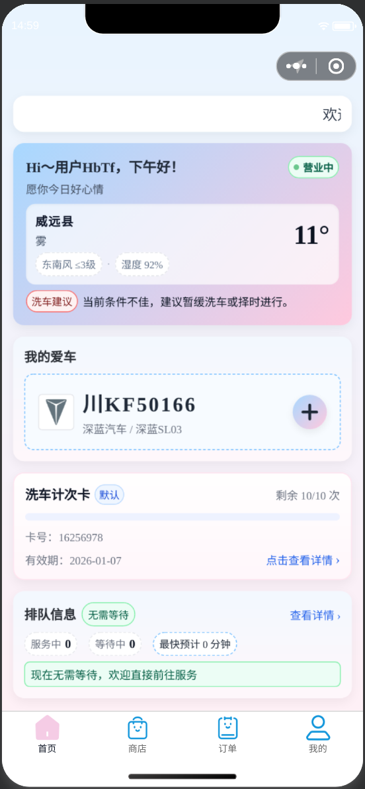
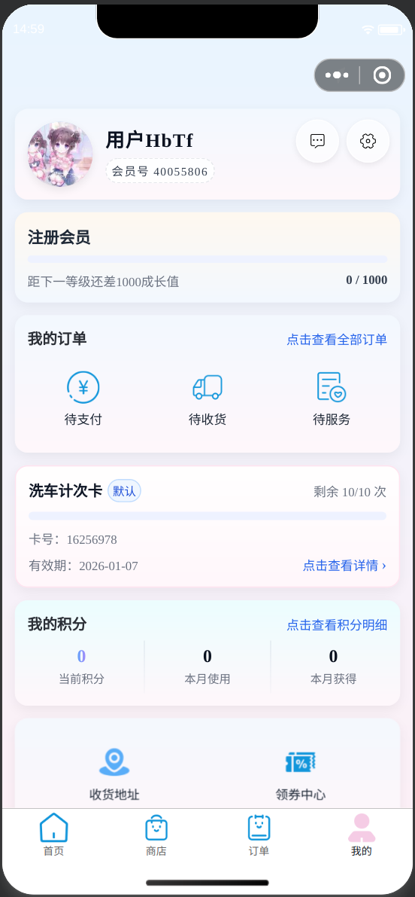
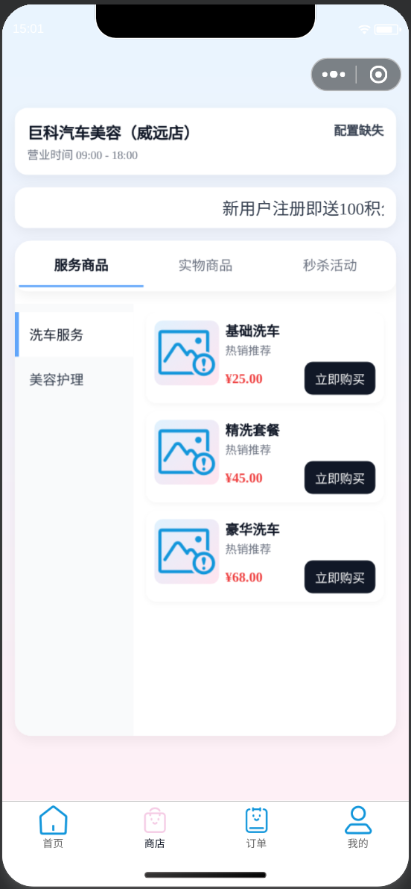
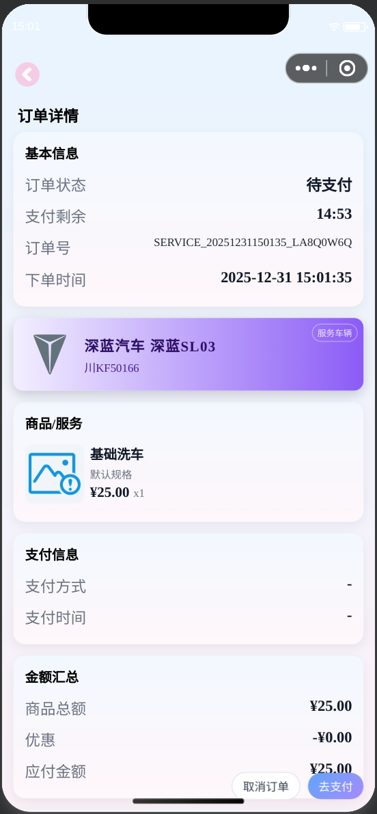
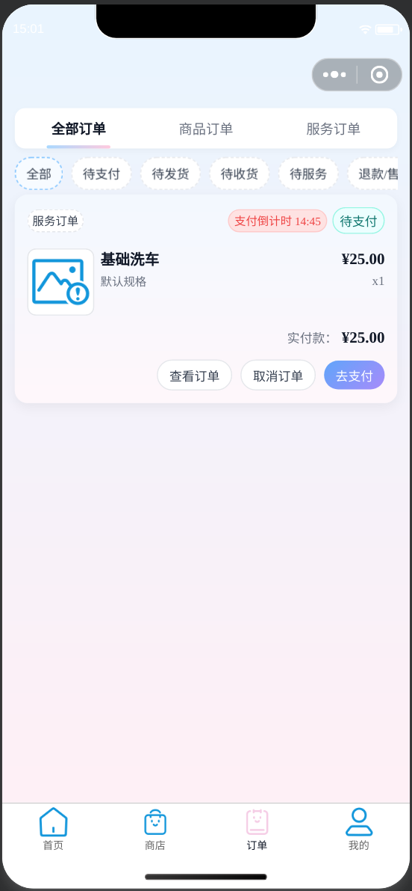
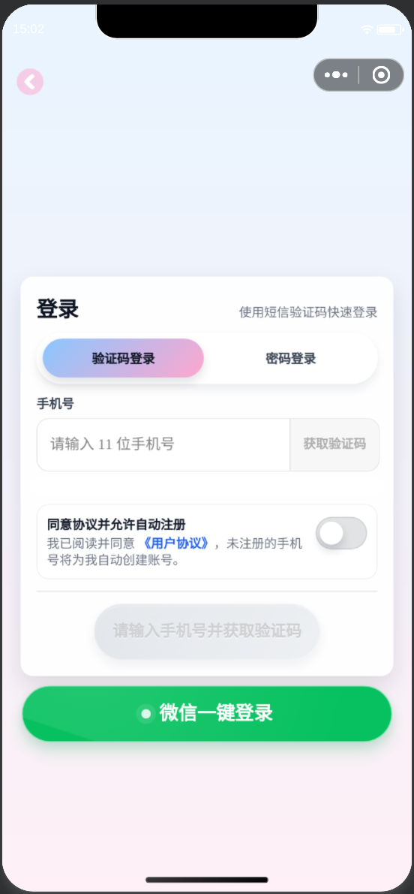
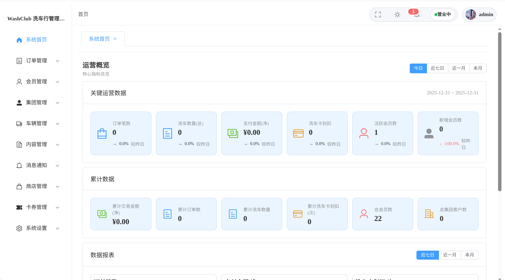
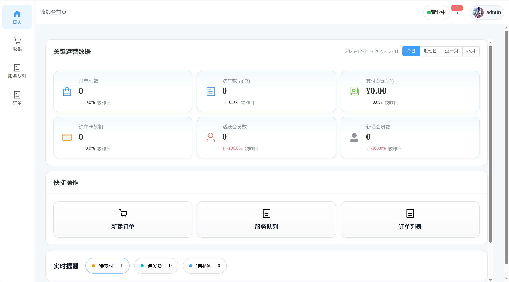

# 巨科汽车美容管理系统

面向单门店汽车美容/洗车业务的一体化系统，包含 NestJS API、管理后台、POS 收银端、uni-app 微信小程序，以及由 OpenAPI 生成的共享 API Client。仓库采用 pnpm workspace + Turborepo 管理。

> 项目由 AI 辅助迭代而来，并已在小体量真实环境中使用，但这不等于已经通过安全、并发、灾备或财务正确性验证。2026-08-15 的代码审计仍发现未修复的 P0 安全问题。对公网部署、接入真实支付或操作真实数据库前，请先阅读 [安全说明](./SECURITY.md) 和 [已知问题](./docs/known-issues.md)。

## 仓库组成

| 路径 | 角色 | 技术与访问路径 |
| --- | --- | --- |
| `apps/api` | 模块化单体 API | NestJS 11、Prisma 7、MySQL；默认 `http://127.0.0.1:3000` |
| `apps/web-admin` | 管理后台 | Vue 3 + Element Plus + Vite 7；开发端口 5173，部署基路径 `/admin/` |
| `apps/web-pos` | 门店 POS | Vue 3 + Element Plus + Vite 7；开发端口 5174，部署基路径 `/pos/` |
| `apps/miniapp-uni` | 微信小程序 / H5 | uni-app + Vue 3；H5 开发端口 5175、基路径 `/h5/` |
| `packages/api-client` | 后端 API SDK | `apps/api/openapi.json` 经 Orval 生成 |
| `packages/shared-utils` | 跨端基础设施 | API 基址、HTTP、token 与 401 处理 |
| `packages/shared-ui` | 少量 Web 共享组件 | 当前包含业务耦合，不是纯展示组件库 |
| `packages/shared-types` | 共享 schema 试验包 | 当前尚无实际消费者 |

详细边界、数据流和核心业务链路见 [架构说明](./docs/architecture.md)。真实接口以运行时 Swagger `/docs`、后端 Controller 和已提交的 `apps/api/openapi.json` 为准，不再在 README 手抄接口清单。

## 开发环境

- Node.js：推荐 22 LTS，至少 `20.19.0`；Node 22 需 `22.12.0` 或更高。
- pnpm：仓库固定 `9.6.0`，通过 Corepack 使用，避免混用 pnpm 11。
- MySQL 8.x；通知的跨实例与队列能力还会使用 Redis。
- 微信小程序开发需要微信开发者工具。

```powershell
corepack enable
corepack pnpm --version
pnpm --version
corepack pnpm install --frozen-lockfile
```

两条版本命令都应解析为仓库 `packageManager` 声明的 `9.6.0`。Turbo 和部分 package script 会继续调用裸 `pnpm`；若它解析到 pnpm 11，应先修正 Corepack shim/PATH，不要让错误版本重装或清理现有 `node_modules`。

## 最短启动流程

1. 从脱敏模板创建本地配置：

```powershell
if (!(Test-Path apps/api/.env)) { Copy-Item apps/api/.env.example apps/api/.env }
if (!(Test-Path apps/web-admin/.env.development)) { Copy-Item apps/web-admin/.env.example apps/web-admin/.env.development }
if (!(Test-Path apps/web-pos/.env.development)) { Copy-Item apps/web-pos/.env.example apps/web-pos/.env.development }
if (!(Test-Path apps/miniapp-uni/.env.development)) { Copy-Item apps/miniapp-uni/.env.example apps/miniapp-uni/.env.development }
```

这些命令只创建缺失文件，不覆盖已有本地配置。

2. 至少设置 `DATABASE_URL`、强随机 `JWT_SECRET` 和三端 `VITE_API_BASE`。各业务集成所需变量见 [配置说明](./docs/configuration.md)。不要把真实密钥写入 Git。

3. 生成 Prisma Client：

```powershell
corepack pnpm --filter WashClubAPI run prisma:generate
```

数据库结构还必须与已提交 migration 一致。仅在确认脱敏后的目标主机、库名和备份/可恢复性后，才可按 [数据库指南](./docs/database.md) 运行 `corepack pnpm --filter WashClubAPI run prisma:deploy`；该命令会写数据库，Codex 不得自行执行。当前 seed 和旧部署脚本含固定凭据或破坏性行为，不属于推荐的初始化流程。

4. 启动 API、后台和 POS：

```powershell
corepack pnpm dev
```

这个根命令只启动拥有通用 `dev` 脚本的 API、管理后台和 POS，不会启动小程序。也可以分别运行：

```powershell
corepack pnpm --filter WashClubAPI run dev
corepack pnpm --filter web-admin run dev
corepack pnpm --filter web-pos run dev
```

开发入口：

- API 健康检查：`http://127.0.0.1:3000/health`
- Swagger：`http://127.0.0.1:3000/docs`
- 管理后台：`http://127.0.0.1:5173/admin/`
- POS：`http://127.0.0.1:5174/pos/`

5. 按目标单独启动小程序或 H5：

```powershell
corepack pnpm --filter miniapp-uni run dev:mp-weixin
corepack pnpm --filter miniapp-uni run dev:h5
```

微信开发者工具打开 `apps/miniapp-uni/dist/dev/mp-weixin`。

## 常用验证

```powershell
# API、Web 与有 build 脚本的共享包；不包含 miniapp
corepack pnpm build

# miniapp 必须显式验证两个目标
corepack pnpm --filter miniapp-uni run build:h5
corepack pnpm --filter miniapp-uni run build:mp-weixin
```

当前根 `lint` / `format` 是空壳，仓库也没有自动化测试或 Vue SFC 类型检查，不能把命令退出码描述成“测试通过”。准确的验证矩阵见 [开发指南](./docs/development.md)。

## 文档入口

- [文档地图与事实源](./docs/README.md)
- [架构与业务链路](./docs/architecture.md)
- [开发、构建与验证](./docs/development.md)
- [环境变量与配置](./docs/configuration.md)
- [数据库与迁移](./docs/database.md)
- [OpenAPI / API Client 规范](./docs/api-client.md)
- [运行与部署](./docs/operations.md)
- [已知问题与优化顺序](./docs/known-issues.md)
- [安全说明](./SECURITY.md)
- [Codex 协作规则](./AGENTS.md)
- [更新日志](./CHANGELOG.md)

## 当前维护原则

- 后端业务接口优先通过 `@wash/api-client` 使用；上传、WebSocket 和第三方 API 是明确例外。
- `packages/api-client/src/generated/**` 是生成物，不能手改；响应类型缺失应从后端 Swagger DTO 修复。
- 数据库结构以 `apps/api/prisma/schema.prisma` 和迁移目录为准，生产环境只应用已审阅迁移。
- 订单、支付、退款、库存、卡券、积分、洗车卡与集团余额是高风险域，修改必须考虑事务、幂等、金额单位和补偿链路。
- 任何文档结论若与代码、schema、package scripts 或运行结果冲突，以后者为准并同步修正文档。

## 截图

<details>
<summary>展开现有界面截图</summary>

### 小程序

|  |  |  |
| --- | --- | --- |
|  |  |  |
|  |  |  |

### 管理后台与 POS





</details>

## 许可证

Apache License 2.0，见 [LICENSE](./LICENSE) 与 [NOTICE](./NOTICE)。
