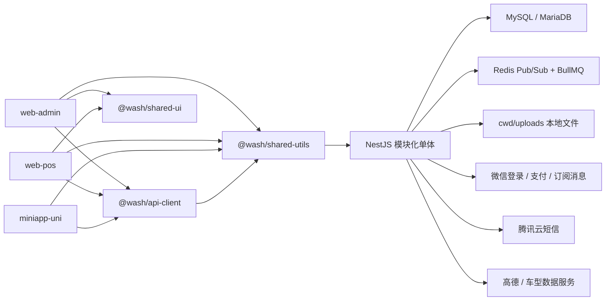
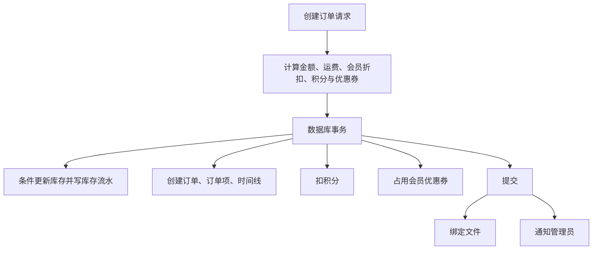

# 系统架构

> 本文描述仓库当前实现，而不是理想设计。最后核对日期：2026-08-15。涉及数据库和生产操作时，同时阅读 [database.md](./database.md) 与 [operations.md](./operations.md)。

## 1. 系统定位

这是一个使用 pnpm workspace 和 Turborepo 组织的洗车门店业务单体仓库。后端是 NestJS 模块化单体；管理端、门店 POS 和会员小程序都通过 HTTP API 访问同一个后端。通知 WebSocket、定时任务、BullMQ Worker 和 HTTP 服务目前运行在同一个 Node.js 进程中。

当前实现没有独立微服务、API Gateway、对象存储适配层或后台任务进程。部署文档不能假定这些组件存在。

## 2. 事实来源（source of truth）

发生冲突时按下表判断，不要根据文件名或旧文档猜测：

| 主题 | 权威来源 | 说明 |
| --- | --- | --- |
| 工作区、包名、可运行命令 | 根目录及各包的 `package.json`、`pnpm-workspace.yaml`、`turbo.json` | 根目录固定 `pnpm@11.19.0` |
| 实际 HTTP 路由和鉴权 | `apps/api/src/**/*controller.ts`、Guard 和装饰器 | OpenAPI 目前不能准确表达所有鉴权和请求体 |
| 业务行为 | `apps/api/src/**/*service.ts` 及事务代码 | Controller 中也存在跨域编排和直接 Prisma 调用 |
| 数据结构 | `apps/api/prisma/schema.prisma` | Prisma 7 的连接 URL 位于 `apps/api/prisma.config.ts` |
| 已部署数据库变更 | `apps/api/prisma/migrations/**/migration.sql` 和目标数据库的 `_prisma_migrations` | schema 与迁移必须一起审查 |
| 启动时环境变量加载 | `apps/api/src/main.ts`、`apps/api/prisma.config.ts` 及各集成 Service | 脱敏模板为 `apps/api/.env.example`，完整语义见 `docs/configuration.md` |
| API 快照 | `apps/api/openapi.json` | 生成物；仅在重新生成并审查后才代表当时代码 |
| 文件持久化 | `apps/api/src/main.ts` 和 `apps/api/src/file/**` | 实际文件在进程 cwd 下的 `uploads/` |

修改行为时，应在同一个变更中同步代码、迁移、DTO/OpenAPI 和本文档。

## 3. 仓库中的端与共享包

| 路径 | 包名 | 角色 | 主要技术 |
| --- | --- | --- | --- |
| `apps/api` | `WashClubAPI` | HTTP API、WebSocket、定时任务、通知 Worker | NestJS 11、Prisma 7、MariaDB adapter |
| `apps/web-admin` | `web-admin` | 管理后台 | Vue 3、Vite、Element Plus |
| `apps/web-pos` | `web-pos` | 门店 POS | Vue 3、Vite、Element Plus |
| `apps/miniapp-uni` | `miniapp-uni` | 微信小程序及 H5 | uni-app、Vue 3 |
| `packages/api-client` | `@wash/api-client` | 三端共用的 API 调用代码 | TypeScript |
| `packages/shared-ui` | `@wash/shared-ui` | Web 端共享 UI | Vue、Element Plus peer dependency |
| `packages/shared-utils` | `@wash/shared-utils` | 跨端工具 | TypeScript |
| `packages/shared-types` | `@wash/shared-types` | 共享类型/校验包 | TypeScript、Zod；是否被业务使用应以 import 为准 |

三个前端包都声明依赖 `@wash/api-client`；服务端 Controller 和 DTO 仍是协议行为的最终依据。修改接口后必须重新生成/更新客户端并构建三个消费端。

## 4. 后端运行模型

入口是 `apps/api/src/main.ts`，启动顺序如下：

1. 从若干候选位置加载 `.env`。
2. 动态导入 `AppModule`，避免模块初始化早于环境变量。
3. 创建 Nest Express 应用，当前全局 CORS 不限制来源。
4. 注册全局 `ValidationPipe({ whitelist: true, transform: true })`。
5. 为微信 v2 退款回调注册原始 XML 中间件。
6. 生成 Swagger 文档并公开到 `/docs`。
7. 创建并公开 `process.cwd()/uploads` 到 `/uploads`。
8. 监听 `PORT`，默认 3000。
9. 将 NotificationGateway 挂到同一 HTTP Server 的 `/ws`，并实例化 NotificationService。

注意：只有 class-validator DTO 上声明过装饰器的字段才会得到有效的运行时校验。当前不少接口使用 TypeScript interface、type 或内联对象类型，它们在运行时不存在，因此“启用了全局 ValidationPipe”不等于所有请求均已校验。

## 5. 后端模块与边界

`apps/api/src/app.module.ts` 注册以下业务模块：

| 模块 | 职责 |
| --- | --- |
| Auth | 管理员/会员登录、JWT、角色权限、短信验证码、员工鉴权 |
| Member | 会员资料、等级、类别、标签、车辆、积分、成长值、签到、个人洗车卡 |
| Group | 集团客户、成员、车辆、余额账户/流水、集团洗车卡、集团小程序接口 |
| Store | 商品分类、商品、SKU、库存及库存流水 |
| Coupon | 优惠券模板、券组、会员券、发放与流转 |
| Order | 下单、支付、履约、评价、超时、售后与退款 |
| Queue | 队列类型、工序模板、排队项和任务推进 |
| Notification | 站内通知、WebSocket、Redis、BullMQ、微信订阅消息、数据库兜底任务 |
| File | 本地上传、文件资产和业务绑定、缩略图、旧文件 API |
| Content | 公告、轮播等内容配置 |
| System | 系统参数及业务开关 |

这些边界尚不严格：

- Auth 与 File 存在 `forwardRef` 循环依赖。
- QueueModule 重复提供 Member/Group 领域 Service；CouponService 也被多个模块重复提供。
- Controller 中存在直接访问 Prisma 和跨多个领域编排的代码。
- 订单取消、库存回滚、优惠券恢复及履约同步在 Order、Queue、Timeout、Refund 中有重复实现。
- `order.service.ts`、`order-payment.service.ts`、`order-refund.service.ts` 都接近或超过 900 行，修改时应先识别事务边界和幂等条件。

新的业务逻辑应进入所属领域 Service；不要继续从 Controller 拼接跨域写操作，也不要在非所属模块重复注册 Service。

## 6. 核心业务链路

### 6.1 下单

主入口位于 `apps/api/src/order/order.controller.ts` 和 `order.service.ts`。

订单类型包括服务订单、商品订单和付款订单；订单始终要求 `memberId`。游客依赖 `GUEST_MEMBER_ID`，集团订单依赖集团占位 Member。

当前关键事实和风险：

- 普通 `POST /orders` 是公开入口，接受调用方传入的 `memberId`。
- 普通下单的商品名称、单价、折扣、数量和运费等仍主要信任请求值，未统一从 Product/SKU 服务端重算。
- `_pointsEligibleRatio` 被暂存在单例 OrderService 实例上，并发请求可能串值。
- 积分余额和优惠券占用仍有先读后写竞态。
- `GET /orders/by-no/:no` 与 `GET /orders/:id` 缺少一致的订单所有权校验。

因此，在完成服务端定价、DTO 校验和会员所有权修复前，不能把订单创建接口视为安全边界。

### 6.2 支付和支付后处理

`apps/api/src/order/order-payment.service.ts` 支持现金、收钱吧、线下、微信 JSAPI、微信付款码、洗车卡和集团余额。

支付成功首先以条件更新将订单从 `UNPAID` 切换为 `PAID`。随后分别执行时间线、通知、会员奖励、虚拟卡发放、集团充值入账、自动关闭和队列清理。这些后续动作不在一个事务或 outbox 中，且部分异常会被忽略。因此“订单 PAID”目前不保证所有权益已经发放，运维必须能对账并补偿。

微信 v3 支付/退款通知当前主要依赖回调密文解密，没有完整验证微信签名请求头以及订单金额、商户号、appid 等上下文。修复前应视为 P0 安全债务。

集团余额使用 version 字段做乐观锁。个人洗车卡仍存在读取余额后绝对更新的并发丢失风险。集团余额和洗车卡支付时，`Order.payAmount` 可能为 0；财务统计不能只汇总该字段。

### 6.3 排队和服务履约

`apps/api/src/queue` 管理队列类型、工序模板、排队项及任务。排队项可以关联车辆和订单，状态推进会同步订单的 fulfillment 状态。

门店创建服务订单时会从商品/SKU 读取价格，但“创建订单”和“加入队列”不是同一个事务；后者失败可能遗留孤立订单。确认完工后的订单同步和通知也发生在队列事务之外。

第一阶段安全修复后，`set-current`、`finish-task`、`confirm-complete`、`start-first`、删除和入队等写操作均要求管理员 `service-queue` 权限，当前不向员工开放。管理端和 POS 使用受保护的 `GET /queue/manage-list`；公开 `GET /queue/list` 只查询 `IN_QUEUE`/`SERVING`，数据库投影不读取手机号、订单号或完整会员对象，响应再经白名单 mapper 和服务端车牌遮罩。公开 ETA 也只计算启用类型与进行中队列。

### 6.4 超时、取消、售后和退款

`apps/api/src/order/timeout.service.ts` 默认每 60 秒扫描一次：取消超过 15 分钟的未支付订单；`payAfterService` 服务订单在 24 小时后标记逾期。库存和订单状态主要在事务内处理，优惠券恢复在事务外。

退款位于 `apps/api/src/order/order-refund.service.ts`。它会处理库存、积分、优惠券、会员奖励、洗车卡和集团余额回滚，但完整退款不是单一事务。崩溃或重试可能导致部分或重复补偿；微信 v2 退款回调目前还可能在内部失败时返回 SUCCESS。

对这些流程的修改必须同时设计：幂等键、可重试步骤、失败状态、对账查询及人工补偿，而不是只增加 `try/catch`。

### 6.5 会员和集团

后台 User 与业务 Member 是两套身份。Employee 是与 Member 一对一关联的门店员工标记。

- `GUEST_MEMBER_ID`、集团占位会员和 `NO_PLATE_NUMBER` 是订单、车辆、通知过滤等流程依赖的基础配置。
- GroupMember 的 `memberId` 唯一，一个会员当前只能属于一个集团。
- 车辆可属于会员或集团，但数据库未约束二者互斥。
- 集团余额用账户 version 和流水记录；集团洗车卡为另一套模型。
- 集团小程序当前普通成员可以查看较多集团成员、卡和流水数据；充值付款人也缺少完整的集团归属校验。
- 集团软删除、最后一名管理员移除和查询过滤存在不一致。

### 6.6 通知

通知数据存储在数据库，实时通知和异步任务使用 Redis：

- WebSocket 路径为 `/ws`，连接后 5 秒内必须发送首条 `{ "type": "auth", "token": "..." }` 消息。
- Redis Pub/Sub 频道用于广播；BullMQ 队列名为 `notify`。
- `NotificationJob` 是数据库兜底任务，进程内调度器会持续扫描。
- 未提供 Redis 配置时仍会尝试本机 `127.0.0.1:6379`。
- 当前没有独立 worker 进程或完整优雅停机清理。

通知失败不能作为支付或订单主事务回滚条件；需要通过持久化任务状态和对账恢复，而不是静默忽略。

### 6.7 文件

文件二进制存放在 `process.cwd()/uploads`，`FileAsset` 和 `FileBinding` 只保存元数据及业务引用。

- `/uploads` 是公开静态目录，`FileAsset.isPublic` 目前不会阻止直接 URL 访问。
- 新 `/assets` 和旧 `/file` API 并存。
- 文件绑定使用业务类型/ID 字符串，不是数据库外键。
- 数据库与 uploads 必须作为同一个恢复点备份。

涉及私密资料时，不能只设置 `isPublic=false`；需要改为受鉴权的下载链路或外部私有对象存储。

## 7. 鉴权与权限

管理员与会员 JWT 共用 `JWT_SECRET`，通过 payload 的 `type` 区分：

- AdminGuard 会重新查询 User 和角色状态，并支持 `*` 或 `@RequirePerm()` 精确权限。
- AdminOrEmployeeGuard 接受管理员，或被 Employee 记录标记的会员；员工允许与否由 `@AllowEmployee()` 控制，没有更细的员工权限模型。
- AdminOrMemberGuard 用于需要兼容管理员/会员的文件资产上传，也用于改手机号入口的统一 Bearer 验证；改手机号 Controller 会在 Guard 后进一步显式拒绝 admin，仅接受 `kind=member`。

部分 Controller/Service 自行解析 JWT，行为不一致，有的不会重新检查账号或角色是否已禁用。新增接口必须使用统一 Guard，不得复制手写 Bearer 解析。

第一阶段已经关闭的鉴权问题：

1. `POST /auth/change-phone` 现在要求会员 token，memberId 从 token 推导，并同时验证当前手机号和新手机号验证码。验证码与 member/手机号/阶段/有效期/尝试次数绑定，双码与手机号更新在事务中条件消费；旧单验证码契约不再兼容。
2. 本轮列出的 Content、会员等级/类别/标签、商品/分类、优惠券组、队列类型和队列状态写接口已补 `AdminGuard` 与真实权限键。
3. 公开队列与管理队列已拆分，公开响应不包含 Member/Group、手机号、密码、openId、VIN、订单 ID 或完整车牌。

仍待处理的鉴权问题包括：

1. 车辆路由使用的 `vehicles` 权限键与已定义的 `member-vehicles` 不一致。
2. demo seed 的角色权限键已过期。
3. 没有全局限流；CORS 当前完全开放。
4. 会员列表的内联新建标签和 POS 队列入口仍需按权限做前端降级；后端写接口保持默认拒绝。

这些是安全修复清单，不是允许继续沿用的设计约定。

## 8. OpenAPI 与客户端

运行时 Swagger UI 位于 `/docs`，生成快照为 `apps/api/openapi.json`。当前快照有 257 个 path、314 个 operation 和 105 个 schema。本阶段改动的鉴权接口已声明 Bearer security，车型、改手机号和队列响应已补 DTO；全仓仍有大量 operation 缺少响应 schema，且部分写操作仍使用无法反射的内联请求体。

原因包括：

- `.addBearerAuth()` 只定义 bearer scheme；未显式声明 `@ApiBearerAuth()` 的 Controller 仍不会自动生成 operation security。
- 大量请求体使用 interface、type 或内联类型，Swagger 和 ValidationPipe 无法获取运行时元数据。

`pnpm --filter WashClubAPI run openapi` 会先构建，再导入完整 AppModule。它会连接数据库、尝试 Redis、启动定时任务并覆盖 `openapi.json`，最后脚本强制退出。它不是纯静态生成命令；只能在隔离环境、有正确配置时运行，并审查生成 diff。

推荐的接口变更顺序：

1. 定义带 class-validator 和 Swagger 装饰器的 DTO。
2. 明确 Guard、权限、所有权和公开性。
3. 修改 Service 和事务。
4. 在隔离环境生成 `openapi.json`。
5. 从根目录执行 `pnpm generate:client`。
6. 构建 API、管理端、POS 和小程序。

## 9. 当前风险优先级

### P0：暴露或资金风险

- 已完成第一阶段：修复公开改手机号的账号接管路径。
- 订单创建改为服务端定价、严格 DTO 校验并校验会员所有权。
- 已完成本轮范围：给列出的管理写接口和队列状态写接口补 Guard/权限；全仓仍需继续审计。
- 已修复公开队列列表的数据泄漏；公开订单详情和所有权仍待处理。
- 为微信支付/退款回调校验签名、商户、appid、订单号和金额。
- 禁用 `scripts/deploy-production.sh` 等危险旧脚本并轮换仓库历史凭据。

### P1：一致性和可恢复性

- 为支付后权益发放建立 outbox、幂等任务和对账流程。
- 将退款与补偿改造成可重试状态机，消除部分成功和重复回滚。
- 统一 JWT 解析和权限键。
- 修复 Prisma 7 下已失效的 seed/backfill/维修脚本。
- 为 API 增加 typecheck、lint、测试和 CI 门禁。

### P2：可维护性

- 拆分超大 Order 服务并明确单一状态所有者。
- 消除重复 Service provider 和跨模块直接 Prisma 写入。
- 统一文件 API、持久化目录与私有文件策略。
- 增加 Redis 可禁用配置和完整优雅停机。
- 逐步清理空 catch、`any`、内联请求体和 OpenAPI 缺口。
